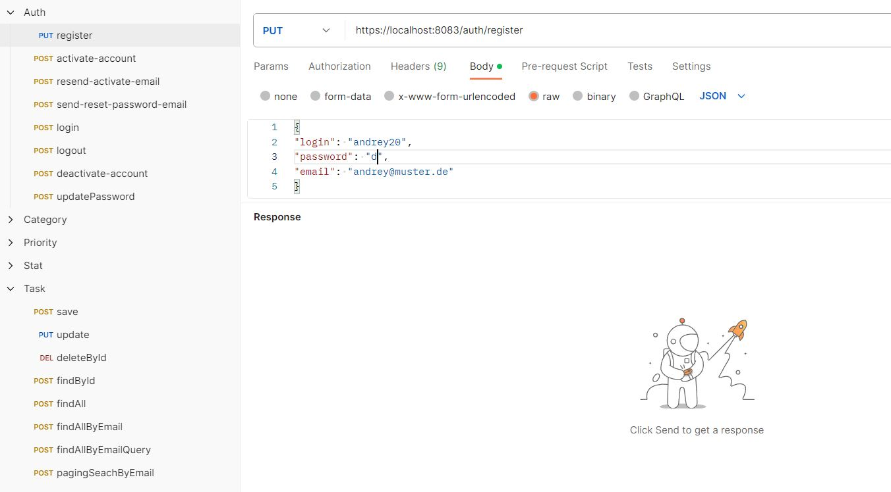
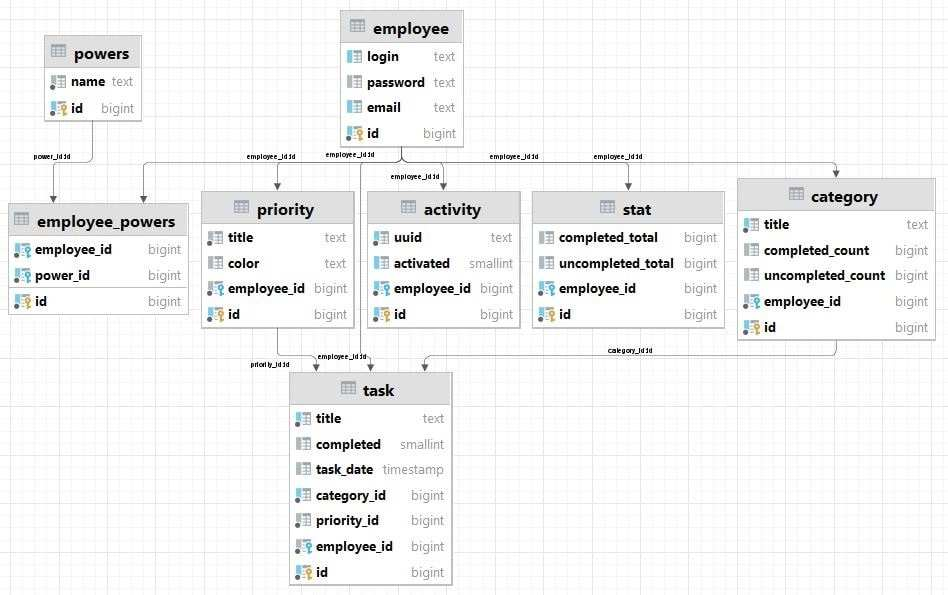

# Onboarding Tool (Backend)

Spring Boot Projekt

Spring Boot Version: 3.2.0

Java Version: 16

Datenbank: PostgreSQL

<b>Components (Dependencies):</b>
1. Spring Boot DevTools
2. Spring Web
3. Spring Data JPA
4. Spring Security
5. Spring AOP
6. Spring Validation
7. Spring Mail
8. Spring Test
9. Maven
10. PostgreSQL Driver. Version 42.6.0
11. JWT (JSON Web Token) Library. Version 0.12.3 
12. Lombok. Version 1.18.30

Das Frontend Projekt: <a href="https://github.com/andreyboiv/onboarding-tool-frontend">https://github.com/andreyboiv/onboarding-tool-frontend</a>

<b><h2>Kurze Beschreibung des Projektes (fachlich):</h2></b>

Ein neuer Mitarbeiter hat eine gewisse Anzahl von Onboarding Aufgaben zu
erledigen. Wenn alle diese Aufgaben vom Mitarbeiter erledigt sind, 
soll der Workflow ja beenden. 
Dabei wird der Mitarbeiter vom System ausgeloggt bzw. 
deaktiviert und per E-Mail benachrichtigt. Die Benachrichtigung erhält 
das Onboarding Team entsprechend auch.

<b><h2>Was wurde gemacht (technisch):</h2></b>

1. Eine Datenbank wurde entworfen
2. Erstellen und Konfigurieren eines Spring Boot-Projekts
3. Datenbank-Mapping wurde realisiert (entsprechende Entity-Klassen wurden erstellt).
   Dabei wurden Beziehungen (One-to-One, One-to-Many und Many-to-Many)
   mit entsprechenden Annotationen aufgebaut.
4. SSL-Authentifizierung wurde implementiert (lokal)
5. Entsprechde Repositories, Services und Controller wurden implementiert
6. AOP für Controllers Methods wurde implementiert
7. Die Mitarbeiter-Authentifizierung wurde mit JWT-Token implementiert
8. Die Mitarbeiter-Autorisierung wurde eingestellt
9. Mail Services wurden erstellt.
10. JUnit Tests wurden an einigen Stellen erstellt*.

* - Alle Controllers, Services und Repositories wurden manuell grundsätzlich getestet. 
Deshalb war die JUnit Testing nur ja an wichtigsten Stellen nötig. 
Außerdem sind z.B. CategoryController und TaskController momentan von außen nicht erreichbar geworden. 
Wichtig zu testen sind die Klassen, die mit der Authentifizierung (Anmeldedaten) 
und mit der Autorisierung (Rechten) zu tun sind. Das sind die entsprechenden JUnit Tests 
dafür: AuthControllerTest, EmployeeServiceTest und 
EmployeeRepositoryTest.

<b><h2>Beschreibung des Projektes (Controller Entry-Points Sicht. Siehe AuthController Klasse):</h2></b>

1. <b>Registrierung. (auth/register)</b>

Es wird einen neuen Mitarbeiter registriert. Das Passwort wird mit
BCryptPasswordEncoder (BCrypt - https://ru.bitcoinwiki.org/wiki/Bcrypt) kodiert und im kodierten Form in der DB abgespeichert. 
Nach der erfolgreichen Registrierung wird ein Link 
zum Aktivieren des Accounts 
von einem Mitarbeiter an die 
angegebene E-Mail (bei der Registrierung) abgeschickt.

2.  <b>Aktivierung. (auth/activate-account)</b>

Es wird einen neuen Mitarbeiter aktiviert. Nach dem erfolgreichen 
Aktivieren erhält der Mitarbeiter eine Begrüßung E-Mail mit einem Bestätigungslink.

3. <b>LogIn. (auth/login)</b>

Ein Mitarbeiter kann sich (nach seinem Aktivieren) anmelden bzw. 
einloggen im System. 
Damit wird ein gültiges JWT-Token auf dem Server erstellt. 
Das JWT-Token wird vom 1 Tag Dauer gültig. 
Es wird keine relevante Information in dem JWT-Token abgespeichert 
(außer Login und Role eines Mitarbeiters). 
Das Aktivieren darf 
nur ein mal durchgeführt werden. 
Wenn der Link (zum Aktivieren) warum auch immer verloren geht, kann man 
anhand <b>"auth/resend-activate-email"</b> 
eine neue E-Mail für die Aktivierung anfordern. 
Da muss man dafür entweder ein Login oder E-Mail eingeben.

4. <b>LogOut. (auth/logout)</b>

<ins>Der Request Ersteller muss angemeldet sein und dabei die Role "User" oder "Admin" haben.</ins>

Ein Mitarbeiter kann sich abmelden bzw. 
ausloggen aus dem System.
Damit wird zunächst eine JWT Validierung von dem existierenden JWT-Token
durchgeführt (siehe AuthTokenFilter) 
und dann wird ein Cookie bzw. JWT-Token 
(das in dem Cookie abgespeichert wird) erstellt. Der neue Token 
wird dann vom Browser automatisch entfernt/gelöscht, 
weil da in diesem neuen JWT-Token eine Parameter "maxAge(0)"
eingesetzt wird.

5. <b>Passwort Ändern. (auth/update-password)</b>

<ins>Der Request Ersteller muss angemeldet sein und dabei die Role "User" haben.</ins>

Dabei wird es zunächst eine JWT Validierung von dem existierenden JWT-Token
durchgeführt (siehe AuthTokenFilter)

Bei einem Mitarbeiter kann das Passwort geändert werden.
Vor allem braucht man aber für eine Passwort Änderung ein Bearer Token, 
das anhand <b>"auth/send-reset-password-email"</b> zu erhalten ist.
Nach der erfolgreichen Passwort Änderung erhält der Mitarbeiter eine
Benachrichtigung (eine E-Mail), dass sein Passwort erfolgreich geändert wurde.

6. <b>Account Deaktivieren. (auth/de-activate-account)</b>

Bei einem Mitarbeiter kann das Account deaktiviert werden.

Dabei wird es zunächst eine JWT Validierung von dem existierenden JWT-Token
durchgeführt (siehe AuthTokenFilter).
Nach dem erfolgreichen Account Deaktivieren erhält der Mitarbeiter eine
Benachrichtigung (eine E-Mail), dass sein Account deaktiviert wurde. Ein Admin erhält 
dabei auch eine E-Mail Benachrichtigung, dass der Mitarbeiter alle Tasks durchgeführt bzw. erledigt hat.

<b>
Siehe Screenshot von Postman.
</b>

 

Der Screenshot zeigt, welche Controller da sind. Die entsprechende Requests 
für Postman kann man unter "\resources\postman_tests_restful_webservices_requests" im Projekt finden.
  
<b><h2>Beschreibung des Projektes (aus Datenbank Sicht):</h2></b>

<b>Die Datenbank (DB) enthält 8 Tabellen und alle Tabellen haben Primary Key mit Auto_Increment. Das sind die Tabellen:</b>
  
1. employee
2. activity
3. powers
4. employee_powers
5. category
6. task

<b><h3>Beschreibung der Tabellen:</h3></b>

1. Die Tabelle <b><ins>"employee"</ins></b> ist eine Tabelle zum Speichern von Mitarbeiterdaten (Credentials Daten). 
Die Daten in der Tabelle werden manuell von Mitarbeitern/Administrator ausgefüllt. 
Die Tabelledaten dienen sowohl für Präsentation als auch für Modifikation.

2. Die Tabelle <b><ins>"activity"</ins></b> zeigt die Registrierungsdaten eines Mitarbeiters an. Die Tabelle "activity" steuert Mitarbeiterdaten wie die Tabelle "employee" und steht zur Tabelle "employee" in einer 1:1-Beziehung.
Daten der Tabelle dienen nur für Präsentation und nicht für Modifikation.

3. Die Tabelle <b><ins>"powers"</ins></b> ist eine Tabelle, die Befugnisse eines Mitarbeiters enthält. Standardmäßig hat die Tabelle die folgenden Berechtigungen:
 
   &nbsp;&nbsp;&nbsp;  a. Berechtigungen eines Mitarbeiters (USER) 
 
   &nbsp;&nbsp;&nbsp;  b. Berechtigungen eines Administrators (ADMIN).
 
Die Daten in der Tabelle dienen nur für Präsentation und nicht für Änderung.

4. Die Tabelle <b><ins>"employee_powers"</ins></b> ist eine Tabelle eines Mitarbeiters und seiner Befugnisse. Die Befugnissdaten werden aus der Tabelle "powers" entnommen. Dementsprechend sind die Tabellen "employee" und "powers" mit einer N-zu-N-Beziehung durch die Tabelle "employee_powers" verbunden. Ein Mitarbeiter kann mehrere Befugnisse haben.
Bei der Registrierung eines neuen Mitarbeiters im System werden diesem Mitarbeiter standardmäßig nur die Rechte eines Mitarbeiters (USER) zugewiesen. Die Daten in der Tabelle „employee_powers“ dienen nur für Präsentation und nicht für Änderung. Gleichzeitig dürfen einige Mitarbeiter ausnahmsweise Administratorrechte haben. Dazu muss der Datenbank Administrator einen entsprechenden Eintrag in die Tabelle "employee_powers" einfügen.

5. Tabelle <b><ins>"category"</ins></b> ist eine Tabelle, die Aufgabenkategorien enthält. 
Die Daten der Tabelle werden hauptsächlich nur für Präsentation verwendet. 
Dies bedeutet natürlich nicht, dass keine neuen Datensätze in die Tabelle "category" hinzugefügt werden können.

6. Tabelle <b><ins>"task"</ins></b> ist eine Tabelle, die Aufgaben eines Mitarbeiters enthält. Aufgaben haben Beschreibung, Kategorien und Prioritäten. Eine Aufgabe ist zu einem Mitarbeiter zugeordnet. Die Daten der Tabelle können später ergänzt und geändert werden.
