# Onboarding Tool (Frontend)

Angular 18.2.1

`ng serve` - wird einen Entwicklungsserver ausgeführt

`http://localhost:4200/`- die Hauptseite des Tools

Das Backend Projekt: 

<a href="https://github.com/andreyboiv/onboarding-tool-backend">https://github.com/andreyboiv/onboarding-tool-backend</a>

<b><h2>Kurze Beschreibung des Projektes (fachlich):</h2></b>

Ein neuer Mitarbeiter hat eine gewisse 
Anzahl von Onboarding Aufgaben zu erledigen. 
Wenn alle diese Aufgaben vom Mitarbeiter erledigt sind, 
soll der Workflow ja beenden. 
Dabei wird der Mitarbeiter vom System ausgeloggt 
bzw. deaktiviert und per E-Mail benachrichtigt. 
Die Benachrichtigung 
erhält das Onboarding Team entsprechend auch.

# Autorisierung
Die Autorisierung Form (siehe Screenshot unten). Man loggt sich da ja ein 
(wenn man früher natürlich schon registriert hat).

Dabei hat man die Möglichkeit bei der Form entweder sich zu registrieren 
 oder das Passwort zurücksetzten lassen 
(falls das Passwort z.B. verloren/vergessen wurde). Dafür gibt's ja die Links auf die neuen Forms 
("Zur Registrierung Form" und "Passwort zurücksetzen" entsprechend)

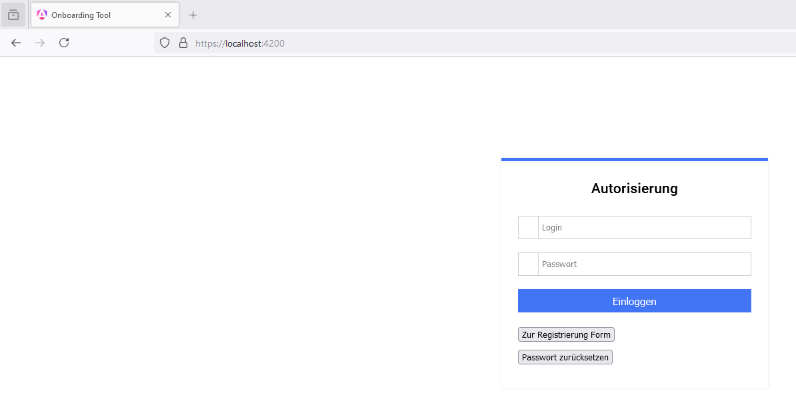

Es gibt eine Validierung bei der Autorisierung Form (siehe Screenshot unten) 

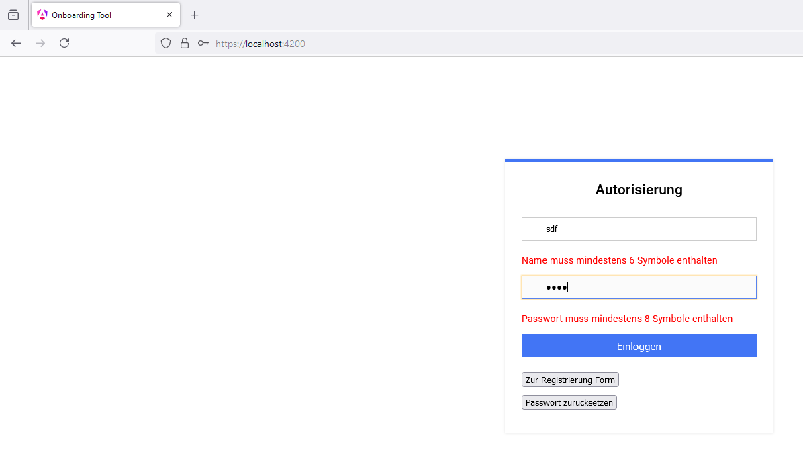

# Onboarding Haupt Form
So sieht die Onboarding HauptForm aus (siehe Screenshots). 
Auf die Links Spalte sind Kategorien. 
Auf die rechts Spalte sind die Tasks, die zu entsprechenden Kategorien von Tasks gehören.

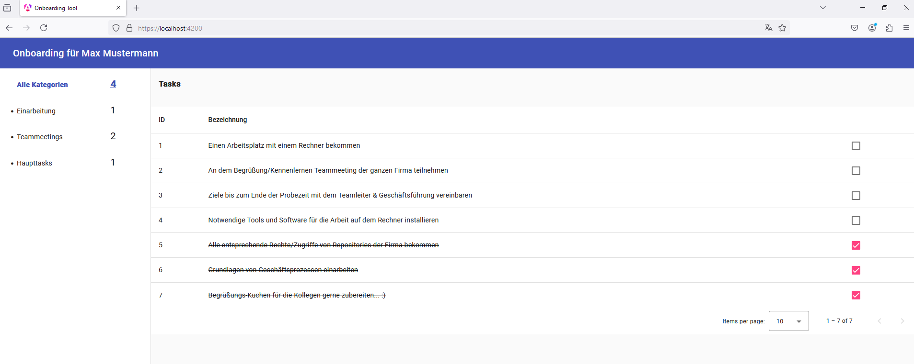

So sieht die Mobile Sicht der Onboarding HauptForm aus:

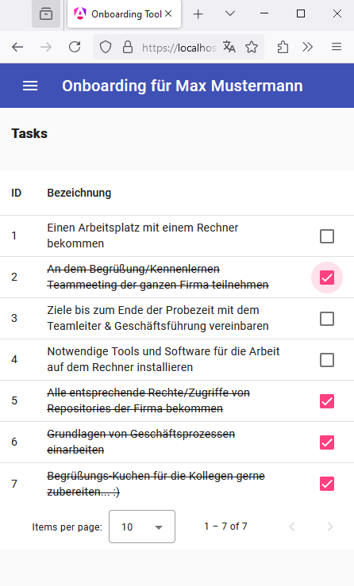

Wenn mann alle Tasks erledigt markiert, 
kommt die Meldung (siehe Screenshot unten). 

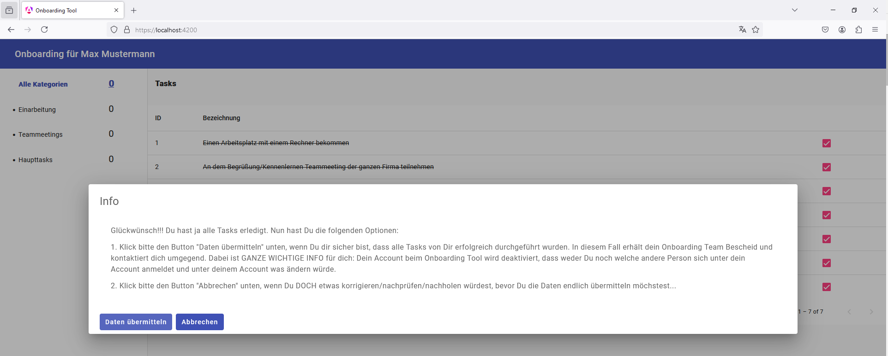

Wenn man "Daten übermitteln" klickt, 
kommt die Meldung:

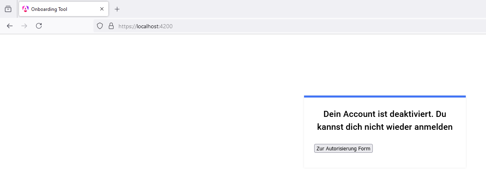

Dabei kommt eine E-Mail:

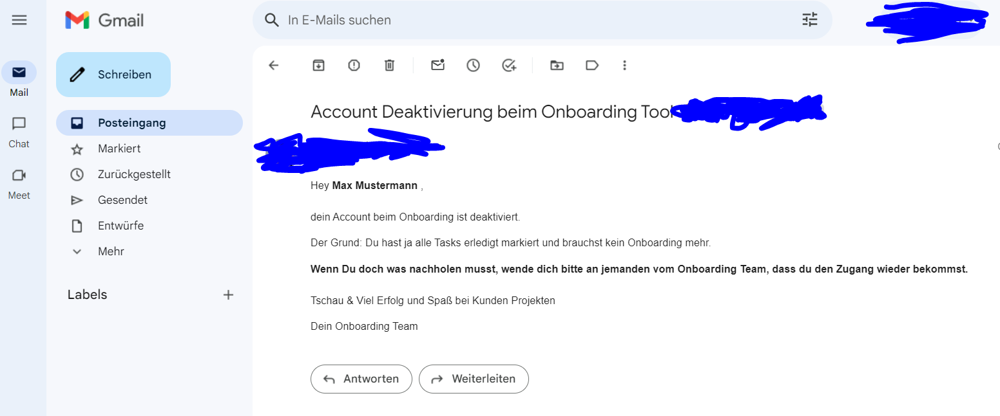 

# Registrierung
So sieht die Registrierung Form aus (siehe Screenshot unten). 

Da gibt man seinen Login (Namen), 
E-Mail, Passwort und ein Captcha für eine extra Validierung ein. Dabei
gibt's die Möglichkeit, auf die Autorisierung Form zu gehen.

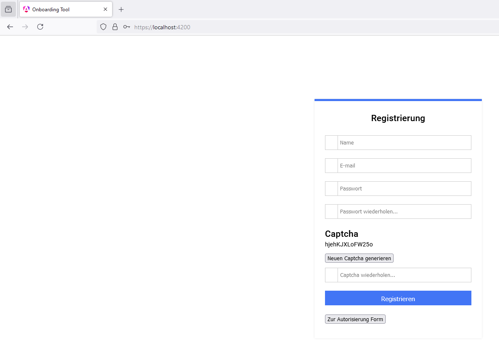

Es gibt eine Validierung bei der Registrierung Form (siehe Screenshot unten)

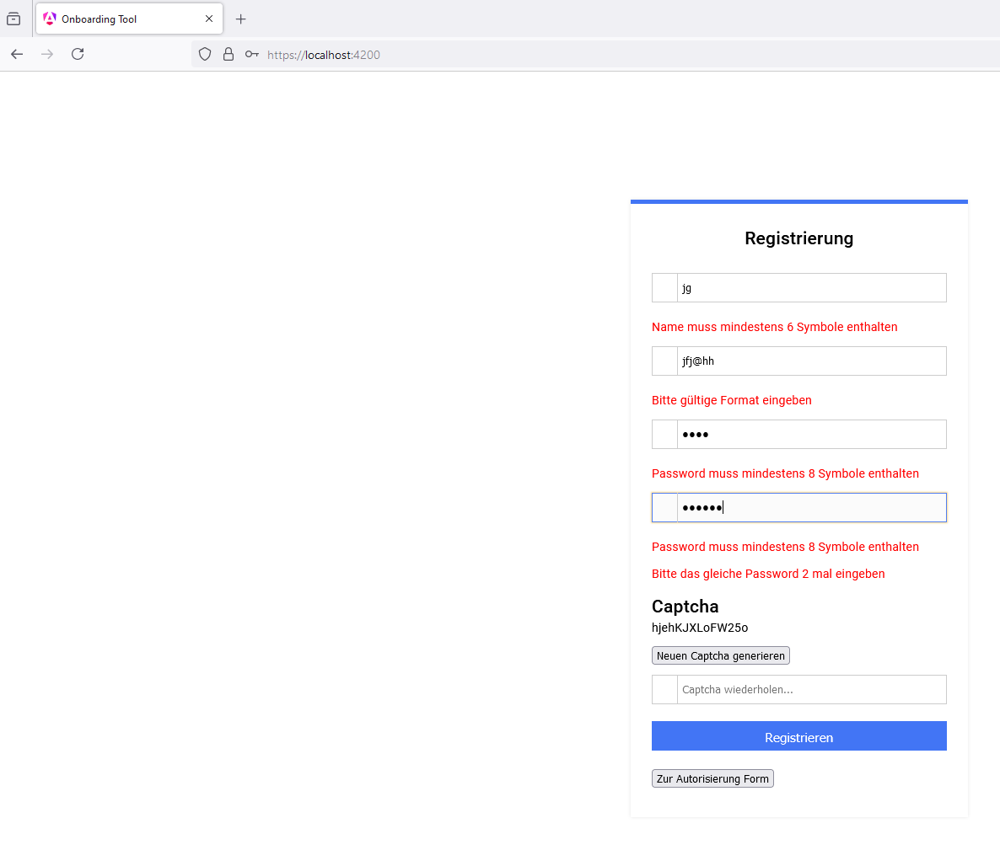

Wenn man die Registrierung Form mit gültigen Daten ausfüllt, und man den "Registrieren" Button klickt, 
kann man die Meldung sehen (siehe Screenshot)

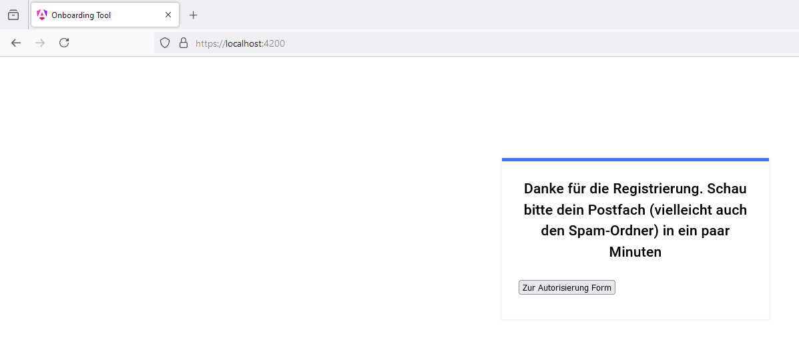

Dabei soll eine E-Mail kommen:

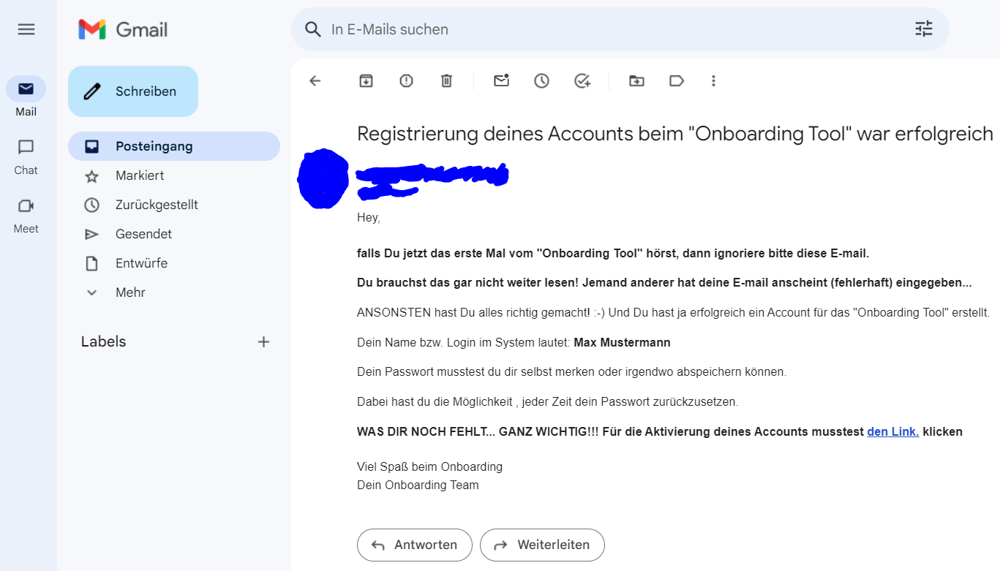 

Nachdem den Link geklickt wurde, kommt die Meldung:

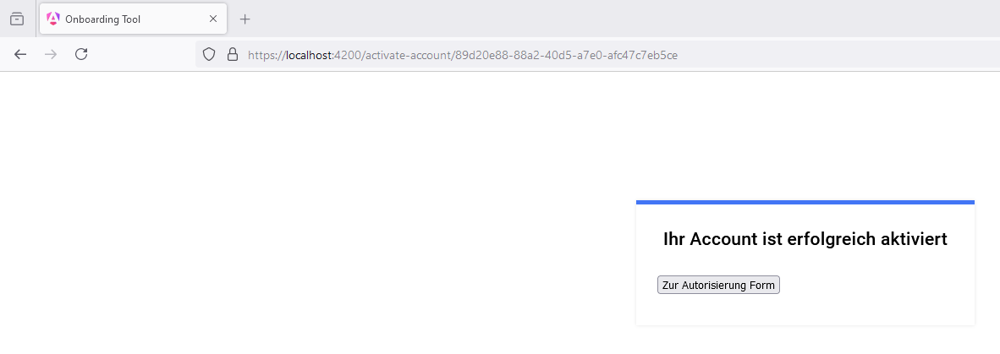

Dabei kommt wieder eine E-Mail, aber schon mit Begrüßung:

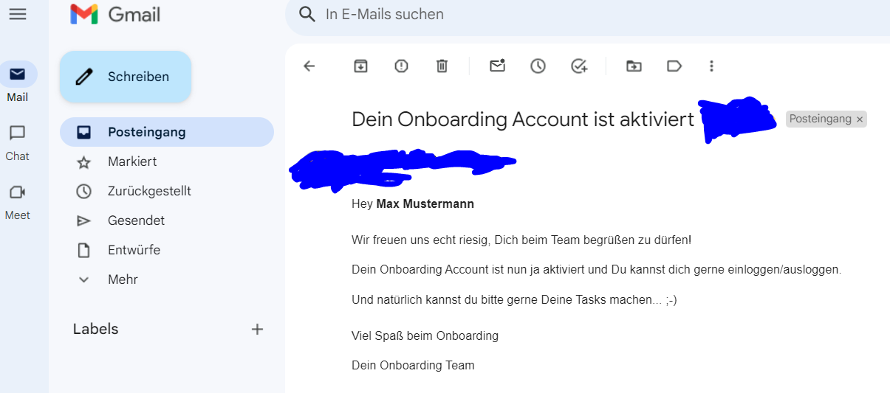

Wenn man auf die Idee kommt, den gleichen Link wieder aufzurufen, kommt dann die Meldung (siehe Screenshot unten). Gleiche Meldung kommt wenn der Link ungültig wäre (bzw. UUID ungültig wäre)

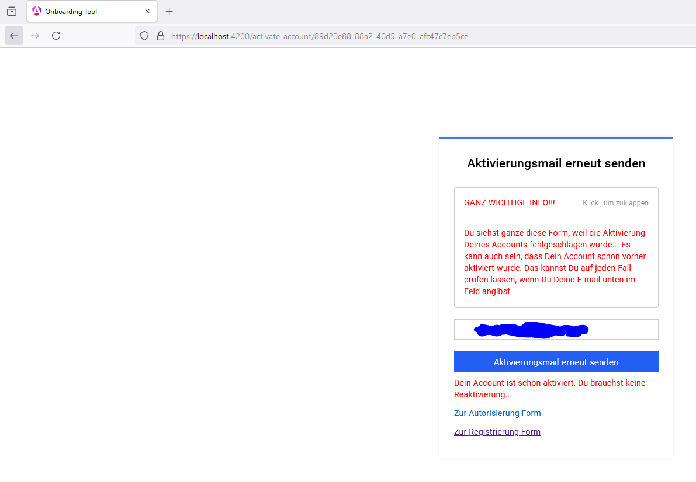

# Zurücksetzen vom Passwort

So sieht die Form vom Zurücksetzen von seinem Passwort:

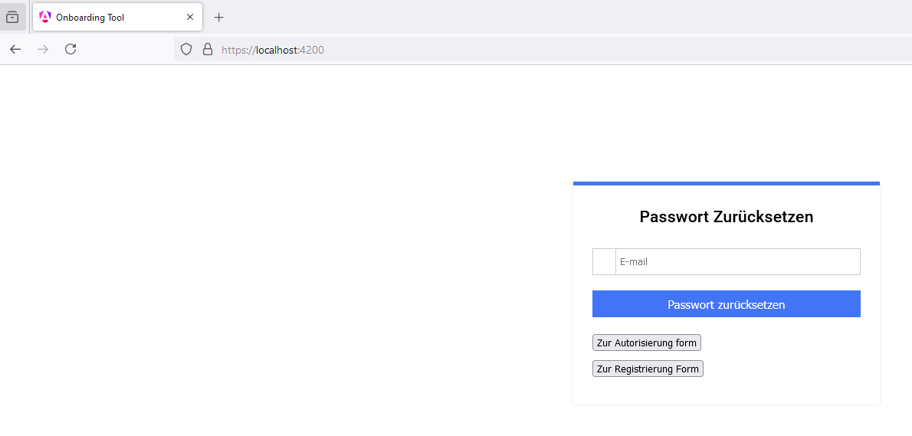

Dabei kann man nur die E-Mail im Feld eingeben, die tatsächlich im System registriert ist. In diesem Fall kommt die Meldung:

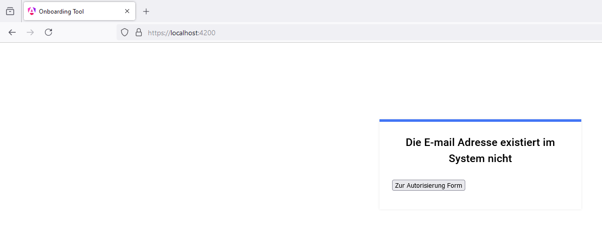

Wenn man eine E-Mail beim Password Zurücksetzen eingibt, die gültig ist (existiert im System), soll die Meldung kommen:

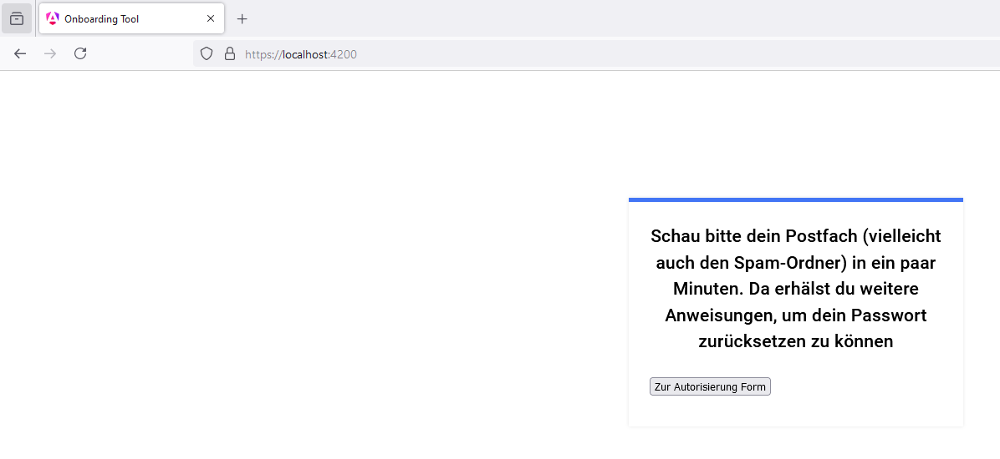

Dabei soll ja eine E-Mail kommen:

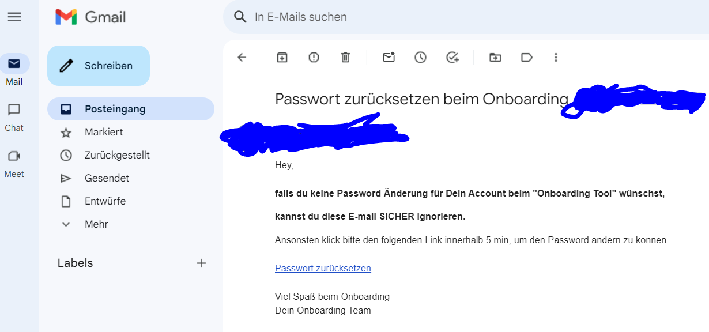

Den Link in der E-Mail geht auf die Seite, wo man sein Passwort ändern kann:

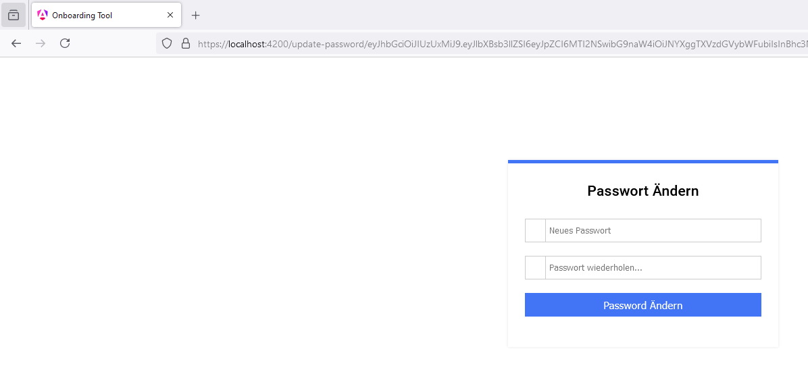

Wenn 5 min vorbei ist, ist der Link nicht mehr aufrufbar (siehe Screenshot unten). 
Gleiche Meldung kommt, wenn der Link nicht gültig ist:

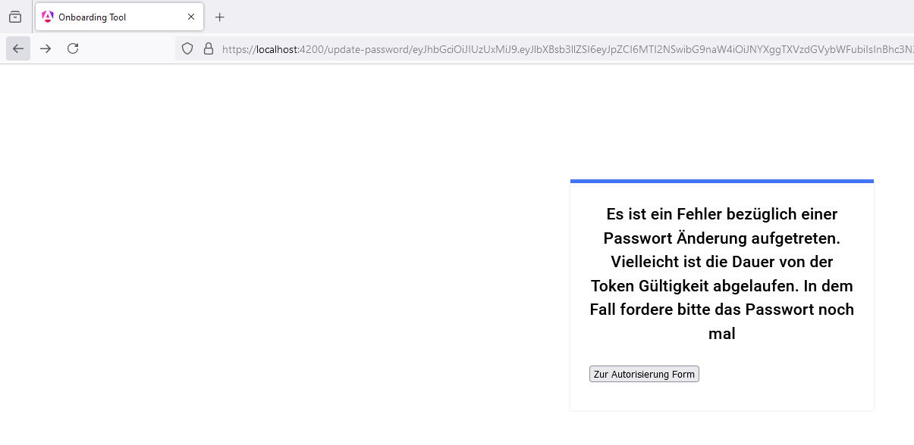

Wenn das Passwort geändert wurde, kommt die Meldung:

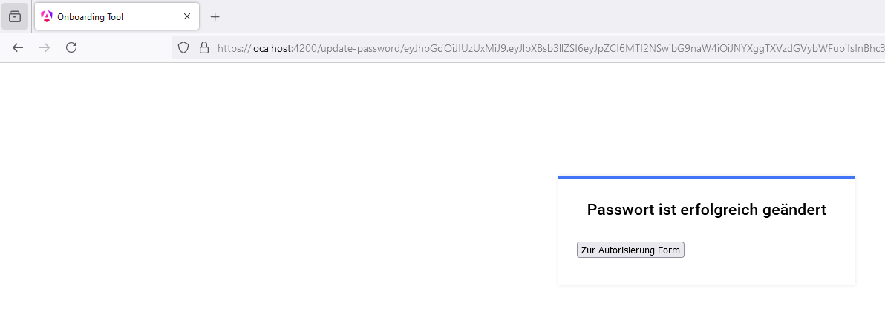

